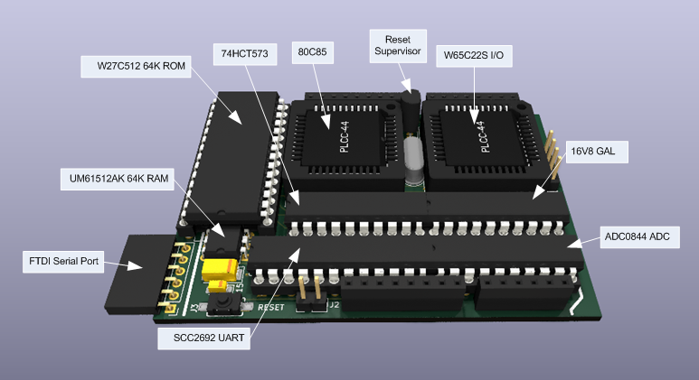

# RetroDuino-8085

I've been toying with the idea of creating an 8085 based microprocessor board around the size of an Arduino UNO ever since I came across the [65uino](https://hackaday.io/project/190260-65uino) board on the hackaday website.

## The basics of the design

I started off with some basics:
| Item | Notes |
| :---- | :---- |
| Microprocessor | an 8085 device but which one and what clock speed |
| ROM | At least 8K maybe 16K - but do I need that much?  |
| RAM | 32K would be good to aim for |
| Serial | 1 serial port but bit bang or hardware? |
| I/O | Bit programmable i/o |
| Analogue In | A multi channel ADC if there's room |
| LEDs | At least 1 user LED |

Oh, and one other requirement - no surface mount chips or hard to solder parts!

That's quite a lot to cram into the footprint on an Arduino UNO!

After a lot of playing around with an Arduino UNO prototyping board and various chip sockets I came up with a basic design and layout.

## The Microprocessor

The 8085 is mostly seen in a 40-pin DIL package. That's a huge amount of real estate on a footprint the size of an Arduino UNO. I discovered that OKI Semiconductor manufactured an 80C85 in a 44-pin PLCC package (MSM80C85AHGS-2K). After a quick bit of digging I located the datasheet and also a source on ebay that was selling some of the chips as NOS (New Old Stock).

Additional board space is consumed as the 8085 has a multiplexed address and data bus. The lower 8-bits are shared between D0..D7 and A0..A7 and an 8-bit latch (74LS573) is used to capture A0..A7.

Another design challenge is that the 8085 interrupts (if I were to use them) are active high rather than active low! 

## ROM

There are quite a few ROM devices available in a PLCC package as well, but I decided to go with a Winbond W27C512 64K x 8 EEPROM in a 28-pin DIL package. There's plenty for sale on ebay too. The reason for going the DIL package route will become clear with the choice of RAM device.

## RAM

I couldn't find any suitable RAM devices in PLCC format so the project success was looking rather bleak. Then I discovered that there were some SRAM devices available in DIL packages that were only 0.3in wide (called Skinny-DIP if I recall correctly). I then got lucky and sourced some UMC UM61512AK 64K x 8 SRAMs in a skinny 32-pin DIL package.

The RAM chip could sit underneath the ROM chip and I would save a lot of board space.

## Serial

I thought about bit banging the serial port using the SID and SOD pins of the 8085 but decided to try and go with real hardware. Again board space was at a premium so the hunt was on for a small UART device. A lot of serial chips have a large number of pins dedicated to various handshaking signals as well as synchronous data transfer - although some devices allow repurposing of these signals as discrete inputs or outputs. They are all still quite large chips in either PLCC or 0.6in DIL packages.

I then discovered a Philips SCC2691 UART (SCC2691AC1N24) that was available in a 0.3in wide 24-pin DIL package. It had an internal baud rate generator and a single 16-bit timer/counter as well. 

## I/O

I really wanted the I/O chip to have pin programmable direction control. That ruled out the 8155 and 8255 chips. It took a lot of searching but I then discovered a Zilog Z85C36. It had 2x 8-bit bit programmable I/O ports as well as 3x 16-bit timer/counters. That would be perfect!

Except that it wasn't! In my v1.0 design, I couldn't get the Z85C36 to respond at all. I don't know quite what the issue was as I was sure that I was meeting the timing requirements - but clearly something wasn't right.

In order to salvage the situation, I changed the I/O chip to a WDC W65C22S device. The chip still gave me 2x 8-bit bit programmable I/O ports, but only 2x 16-bit timer/counters.

## Analogue to Digital Converter

If I could fit it in, then an a National Semiconductor ADC0844 might work out - it's a 4 channel ADC in a 20-pin DIL package. 

# Putting it all together

There was quite a bit of massaging to get everything to fit as I also used a GAL16V8 to handle address decoding and interrupt inversion. The result was a board slightly longer than an Arduino UNO (but the same width).

This is an annotate 3D view of the board as it stands at v1.2.

# The 16V8 GAL

There's so little space on this board that a GAL seemed the logical choice to handle the usual discrete logic. The GAL does address and i/o decoding as follows:
* Memory space
 * 0x0000 - 0x3FFF selects the ROM
 * 0x4000 - 0xFFFF selets the RAM
* I/O space
 * 0x00 - 0x3F selects the SCC2692 UART
 * 0x40 - 0x7F selects the W65C22S digital i/o chip
 * 0x80 - 0xBF selects the ADC0844 ADC chip
 
In addition, the GAL inverts the SCC2692 and W65C22S interrupt signals.

Finally, the GAL has the ability to completely switch out the ROM to give access to the full 64K or RAM. The 8085 SOD pin is used to control this feature.

# What about some code?

I have 2 pieces of code that run on the RetroDuino-8085.

The first is the excellent 8085 monitor program writting by [Dave Dunfield](https://dunfield.themindfactory.com/). You can find the source code to the 8085 monitor along with monitors for other micros in the MONITORS.ZIP file on Dave's website. This needs tweeking to support the specific hardware it is running on but that simply involves providing code to initialise the UART and code to output a characher/byte as well as read in a character/byte.

The second in a version of Microsoft BASIC v4.7 which I got from [Phillip Stevens github site](https://github.com/feilipu/NASCOM_BASIC_4.7).

Both pieces of code have been modified to work with the SCC2691 UART.